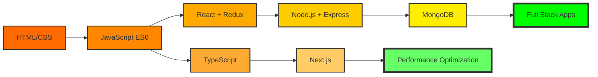

<!-- PREMIUM FULL WIDTH FIRE HEADER -->

---

# 👋 Hi, I'm Trisha Patar

  

---

## 🖥️ DEVELOPER DASHBOARD

<table width="100%">
<tr>
<td width="33%" align="center">
### 💻 VS CODE STATUS
🟢 Active Coding Mode  
🔥 Building Projects  
⚡ Debugging Skills  
🚀 Learning Every Day
</td>
<td width="33%" align="center">
### 🎯 MISSION STATUS
🚀 Full Stack Goal  
🔥 Daily Practice  
⚡ Project Building  
💡 Growth Mode
</td>
<td width="33%" align="center">
### 📡 LIVE SYSTEM
🟢 Online  
⚙️ Processing Skills  
📈 Improving Daily  
💾 Saving Knowledge
</td>
</tr>
</table>

---

## 📱 CONNECT WITH ME

---

## 🌍 CURRENT JOURNEY
> 🤖 **AI-Generated Premium Bio:** A highly ambitious and performance-driven software artisan operating from the coordinates of **Jharkhand**. Dedicated to shipping gorgeous client-side products and bulletproof architecture. Constantly testing new parameters, designing intuitive interactive modules, and keeping current on reactive paradigms.

🧠 Learning modern web development and APIs  
⚡ Building responsive client application grids  
🎯 Improving system scale and layout flows  
🚀 Exploring next-generation AI and developer solutions  
🔥 Compiling projects consistently every single day

---

## 🛠 TECH STACK

---

## ⚡ DEVELOPER ACTIVITY

<table>
  <tr>
    <td align="center">
      
    </td>
    <td align="center">
      
    </td>
   </tr>
  <tr>
    <td colspan="2" align="center">
      
    </td>
   </tr>
</table>
 

---

## 🔥 CONTRIBUTION STREAK

---

## 🚀 FEATURED PROJECTS
### 🌐 Portfolio Website
Responsive personal website and SaaS catalog.

### 📝 Task Organizer
Interactive kanban planner with offline local database architecture.

---

## 🎥 DEVELOPER SPOTLIGHT

 

 
<table align="center">
<tr>
<td align="center">🎯 TODAY'S FOCUS</td>
<td align="center">🚀 PROJECT</td>
<td align="center">⏰ SESSION TIME</td>
</tr>
<tr>
<td align="center"><strong>Full Stack Dev</strong></td>
<td align="center"><strong>Portfolio 2.0</strong></td>
<td align="center"><strong>6h 42m</strong></td>
</tr>
</table>

## 🎧 DEV TUNES (WHILE YOU BROWSE)

  
🎵 *Click any badge above to open your coding soundtrack* 🎵

## 🐍 SNAKE INFRASTRUCTURE

---

## 🏆 ACHIEVEMENTS
🏅 Consistent Learner  
🏅 Frontend Development Mastery  
🏅 Open Source Journey Enthusiast  
🏅 Building Projects Every Week  
🏅 Exploring New Tech Coordinates

## ☕ FUN FACTS
💻 I enjoy coding and experimenting with state loops  
🌙 I love building late at night with music  
🎯 Always improving my system architecture skills  
🔥 Turning creative ideas into custom SaaS software

---

## 📊 INTERACTIVE STATS DASHBOARD

## 🗺️ ADVANCED LEARNING ROADMAP

